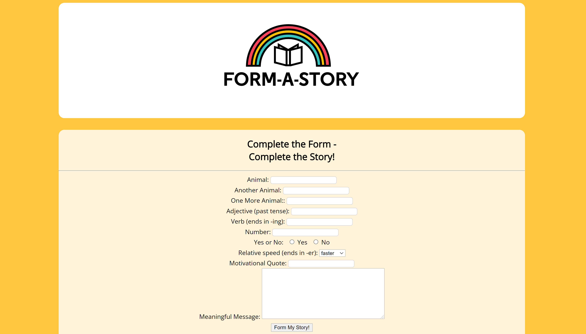

# Form a Story

A website built with HTML and CSS that allows the user to fill an HTML form to generatte a story from form data.

## Table of contents

* [General info](#general-info)
* [Screenshot](#screenshot)
* [Technologies](#technologies)
* [Languages](#languages)
* [Features](#features)
* [Inspiration](#inspiration)

## General info

 This is a challenge project set as part of the Codecademy Back-End Engineer career path course.
## Screenshot

## Technologies

* HTML
* CSS

## Languages

* JavaScript

## Features

The GUI allows users to:
* Fill a form
* Generate a Story from from data
* View the original story

## Status

Project is: _COMPLETE_

## Inspiration

Project created as part of Codecademy Full-Stack Engineer career pathway.

